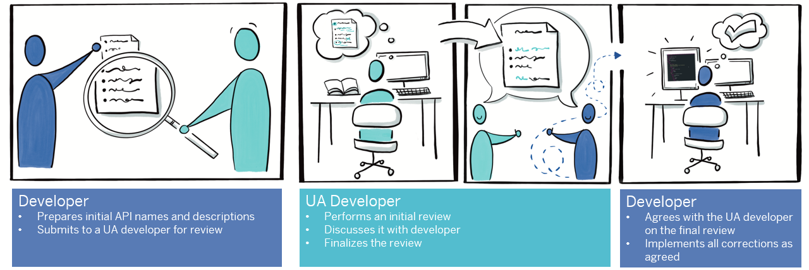
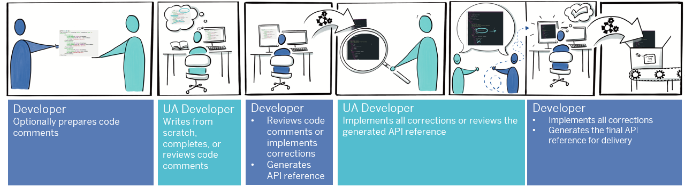
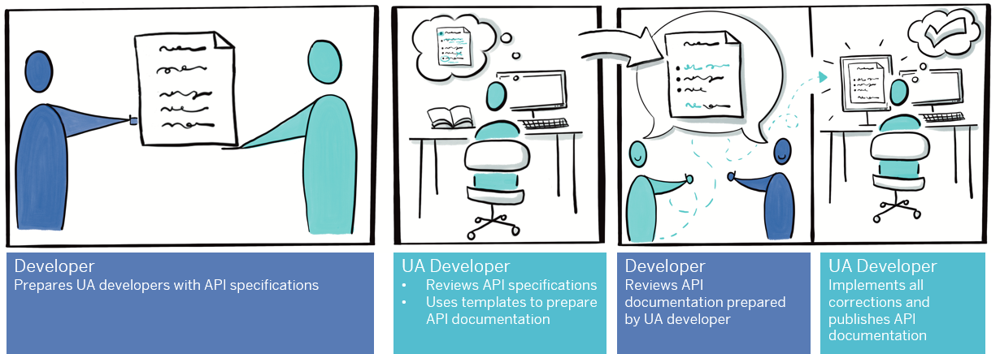
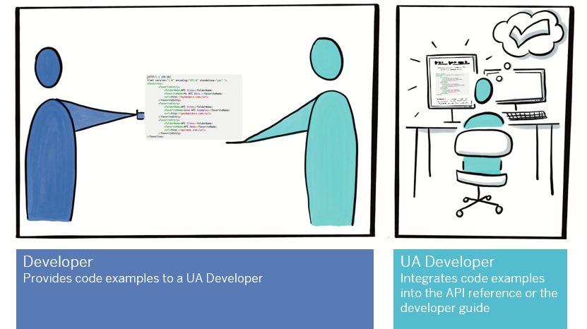
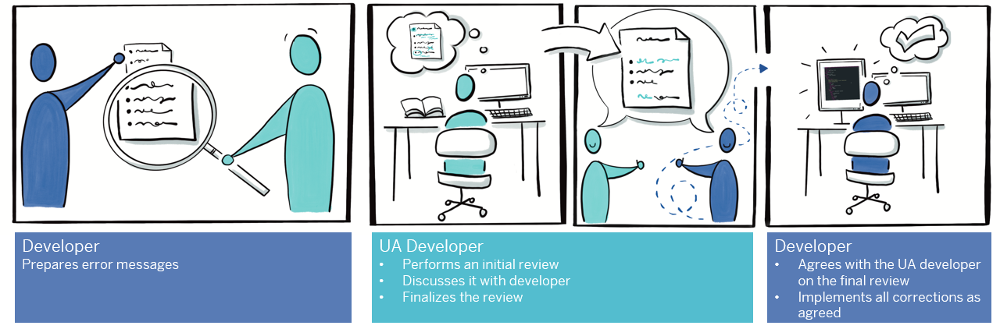
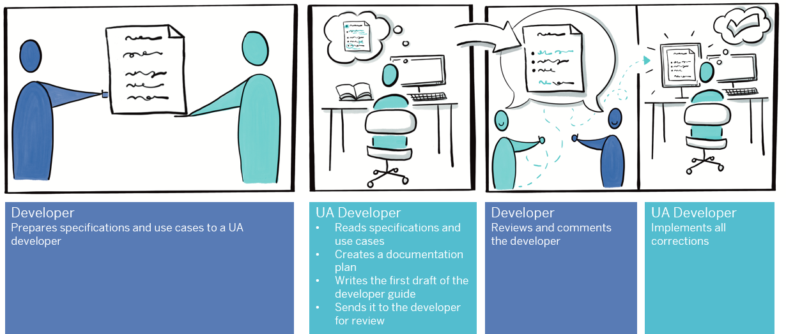
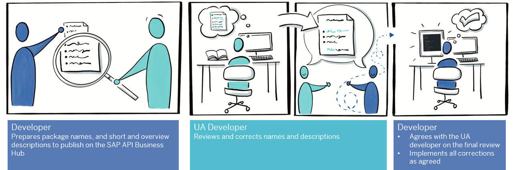
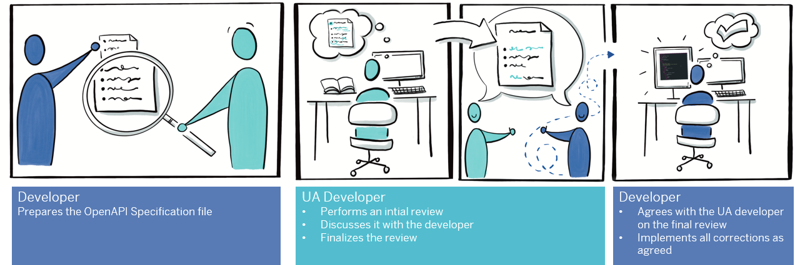

<!-- loio9c65fd7bed214e9384acb71ae454303b -->

# API Review Process

To ensure that an API can be consumed quickly and easily, it's important to have all texts checked and reviewed.

To ensure that the review process runs smoothly, we explain how developers and User Assistance \(UA\) developers work together to produce great APIs.

In addition to the specifics, note the following points:

-   Review texts as early as possible in the development cycle. As with most things, changes further down the line are costly and complex.
-   Good, clear, and correct language can make or break the consumer experience, so review all texts that are visible to the consumers of your API from a language perspective.

<a name="loio9c65fd7bed214e9384acb71ae454303b__section_dts_24v_lhb"/>

## API Names and Descriptions

Let's start at the top. The name and description are usually the first contact that consumers have with your API. The name and description must be meaningful, clear, consistent, and self-explanatory. The following graphic shows who does what and in which sequence:

<a name="loio9c65fd7bed214e9384acb71ae454303b__section_ely_b4v_lhb"/>

## Code Comments for Auto-Generated API Documentation

If your API documentation is generated automatically, developers write and maintain documentation comments in the source code. UA developers review these comments to ensure that they are of good quality.

<a name="loio9c65fd7bed214e9384acb71ae454303b__section_zrt_tf4_ljb"/>

## Manually Written API Documentation

If the API documentation can’t be generated automatically, it’s written manually by UA developers. Developers should provide the API specifications as input. UA developers use the specifications as input for documentation topics that are based on templates. For more information, see [Manually Written REST and OData API Reference](../50-manually-written-rest-and-odata/manually-written-rest-and-odata-api-reference-49b7204.md).

<a name="loio9c65fd7bed214e9384acb71ae454303b__section_wvl_h4v_lhb"/>

## Code Examples

Including examples of code, such as code snippets, in API documentation helps developers to get up and running with an API quickly and easily. Before we get to the details of how to review code examples, note the following points:

-   Code snippets should run correctly in a dev or test environment. Ask developers to check them or do it yourself before adding them to the documentation.
-   Code-sample files and demo applications are often a part of a project's regular testing process. UA developers shouldn’t have to test them.

<a name="loio9c65fd7bed214e9384acb71ae454303b__section_mtf_j4v_lhb"/>

## Error Messages

Reviewing error messages is a major part of an API review. Error messages can appear in debuggers or application interfaces. As classic UI text, they’re consumer-facing. Apply the people-centric approach to these messages to improve customer satisfaction.

<a name="loio9c65fd7bed214e9384acb71ae454303b__section_rgh_k4v_lhb"/>

## Developer Guide

Developer guides complement the API reference by explaining how to use APIs in typical tasks and scenarios, and typically contain conceptual information about the goal, scope, and capabilities of APIs. For more information, see [Developer or Service Guides](../60-developer-or-service-guide/developer-or-service-guides-a9cbf5a.md).

<a name="loio9c65fd7bed214e9384acb71ae454303b__section_dyy_qr1_xhb"/>

## Package Names and Descriptions

APIs on SAP API Business Hub are grouped in a package. A package comprises a collection of related APIs or services that belong to one product or product area. For more information, see [Documenting REST and OData APIs for the SAP API Business Hub](../30-rest-and-odata-api-documentation/documenting-rest-and-odata-apis-for-the-sap-api-business-hub-c9b0e18.md).

<a name="loio9c65fd7bed214e9384acb71ae454303b__section_btv_zr1_xhb"/>

## OpenAPI Specification \(YAML\) File

A document that defines an API according to the OpenAPI specification. The OpenAPI specification is represented in either JSON or YAML format. Throughout the file, there are `description` fields to document the individual entities.

  

