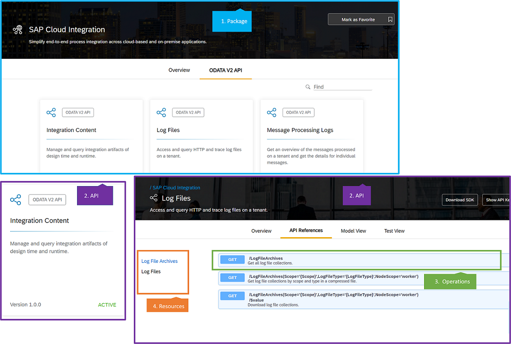

<!-- loioc9b0e180421444c28aa76b955e67a898 -->

# Documenting REST and OData APIs for the SAP API Business Hub

Documenting REST and OData APIs for auto-generation and publication in the SAP API Business Hub.

The [SAP API Business Hub](https://api.sap.com) is a web application hosted by SAP to discover, explore, and test SAP and partner APIs that are required to build extensions or process integrations.

In the SAP API Business Hub, the information about APIs is organized according to the following hierarchy as shown in the SAP Translation Hub API:

-   [Package Descriptions](package-descriptions-22c017a.md)
-   [API Details](api-details-3edef50.md)
-   [Tags](tags-ebbdea3.md)
-   [Operations](operations-8f57974.md)

<table>
<tr>
<th valign="top">

Level

</th>
<th valign="top">

Description

</th>
</tr>
<tr>
<td valign="top">

API package

</td>
<td valign="top">

A collection of related **APIs** or **services**, belonging to one product or product area, packaged and delivered together.

</td>
</tr>
<tr>
<td valign="top">

API

</td>
<td valign="top">

A collection of related **resources** and REST **operations** available for each resource.

</td>
</tr>
<tr>
<td valign="top">

Resource

</td>
<td valign="top">

A remote data entity, identified by a URI, on which **operations** are performed.

</td>
</tr>
<tr>
<td valign="top">

Operation

</td>
<td valign="top">

A data **operation**, such as GET, POST, PUT, UPDATE, or DELETE, performed on a resource.

</td>
</tr>
</table>

-   **[General Guidelines for Descriptions](general-guidelines-for-descriptions-7e6e472.md "Provide descriptions for the various API elements supported by the OpenAPI
		Specification. ")**  
Provide descriptions for the various API elements supported by the OpenAPI Specification.

**Related Information**  

[REST and OData API Documentation](rest-and-odata-api-documentation-d8acc94.md "Guidelines and recommendations to help you write auto-generated and manual REST and OData API reference documentation.")

[API Designer](https://help.sap.com/viewer/e63fe47de8f84a68b618ed689af9a28b/Cloud/en-US/186d9d5f72694954a52a5fa4c56fe5f2.html)

[SAP Content Pipeline](https://help.sap.com/viewer/9c880f03c6084ca4b2573b5605ec7a83/Cloud/en-US/deff14d4a7a8421e839cc21f2709fd22.html)

