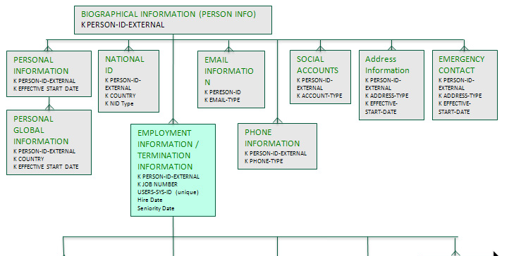

<!-- loiod8acc942e39d44af9231260bbb6a6161 -->

# REST and OData API Documentation

Guidelines and recommendations to help you write auto-generated and manual REST and OData API reference documentation.

<a name="loiod8acc942e39d44af9231260bbb6a6161__section_v1z_b3p_pz"/>

## About REST APIs

REST \(Representational State Transfer\) APIs \(also called RESTful Web Services\) are cross-platform APIs used to perform CRUD \(Create, Read, Update, Delete\) operations on data resources using the HTTP protocol. It uses HTTP methods to interact with resources that are identified using a Uniform Resource Identifier \(URI\). Requests and responses are sent in a structured format.

Unlike SOAP \(Simple Object Access Protocol\) APIs, which are action-oriented, REST APIs are resource-oriented. A SOAP API, for example, requests to get material data, whereas a REST API identifies material data as a resource using a URI and HTTP methods to determine which operation is performed on the resource.

The following table maps CRUD operations to HTTP methods:

<table>
<tr>
<th valign="top">

CRUD Operation

</th>
<th valign="top">

HTTP Method

</th>
</tr>
<tr>
<td valign="top">

Create

</td>
<td valign="top">

PUT/POST

</td>
</tr>
<tr>
<td valign="top">

Read

</td>
<td valign="top">

GET

</td>
</tr>
<tr>
<td valign="top">

Update

</td>
<td valign="top">

PUT/PATCH

</td>
</tr>
<tr>
<td valign="top">

Delete

</td>
<td valign="top">

DELETE

</td>
</tr>
</table>

An individual REST API is defined by the following:

-   Resource URI
-   Operation \(HTTP method\)
-   Request format
-   Request parameters
-   Response format

A REST API is usually a collection of related methods that perform different data operations on the same resource or related set of resources.

<a name="loiod8acc942e39d44af9231260bbb6a6161__section_hf5_g3p_pz"/>

## About OData

The Open Data Protocol \(OData\), defined by OASIS is a REST-based protocol for querying and updating data. It’s built on standardized technologies such as HTTP, Atom/XML, and JSON. The difference between OData and pure REST APIs is that it provides a structured way to describe the data and the data model.

In a nutshell, OData is an open protocol that exchanges data over the internet. A server hosts data, and clients can call the server to retrieve data and then manipulate the data to be used however it needs to be consumed. The data that is retrieved by the client is described by the abstract data model called an Entity Data Model \(EDM\). The central concepts in the EDM are entities, entity sets, relationships, and operations.

-   Entities are data objects of a certain type, such as Customer or Employee.
-   Entity sets are named collections of entities, such as Customers.
-   Relationships connect one entity to another.
-   Operations, such as Create or Update, are executed on entities.

Client applications can query an OData service to discover its data model and capabilities, and perform CRUD operations on entities using REST APIs. Let's use SAP SuccessFactors' `Employment Information` API as an example to see what you can query:

> ### Note:  
> Don’t use abbreviations for entity names. Follow the naming convention guidelines.

<table>
<tr>
<th valign="top">

Query

</th>
<th valign="top">

Description

</th>
</tr>
<tr>
<td valign="top">

$top

</td>
<td valign="top">

Show only the first n items

</td>
</tr>
<tr>
<td valign="top">

$skip

</td>
<td valign="top">

Skip the first n items

</td>
</tr>
<tr>
<td valign="top">

$search

</td>
<td valign="top">

Search items by a specific phrase

> ### Note:  
> Available in OData version 4.0.

</td>
</tr>
<tr>
<td valign="top">

$filter

</td>
<td valign="top">

Filter items by property values, such as `firstDateWorked` 

</td>
</tr>
<tr>
<td valign="top">

$count

</td>
<td valign="top">

Include the item count

</td>
</tr>
<tr>
<td valign="top">

$orderby

</td>
<td valign="top">

Order items by property values, such as `createdOn`, `createdBy`, and `lastModifiedBy`

</td>
</tr>
<tr>
<td valign="top">

$select

</td>
<td valign="top">

Select properties to be returned

</td>
</tr>
<tr>
<td valign="top">

$expand

</td>
<td valign="top">

Expand related entities, such as `empJobRelationshipNav`, `empWorkPermitNav`, and `jobInfoNav`

</td>
</tr>
</table>

The following figure displays a fragment of a sample of SAP SuccessFactors Employee Central data model generated by querying a publicly available OData service \([Employee Central Entity Relationships](https://help.sap.com/viewer/b2b06831c2cb4d5facd1dfde49a7aab5/1911/en-US/e1209c55c4034e3cb6178dcea3faa361.html)\).

 

In this example, you can query the following:

<table>
<tr>
<th valign="top">

Entity

</th>
<th valign="top">

Description

</th>
</tr>
<tr>
<td valign="top">

Personal Information

</td>
<td valign="top">

Person ID, the date the person started working at the company, and country the person is from

</td>
</tr>
<tr>
<td valign="top">

National ID

</td>
<td valign="top">

National ID number, country of issue, and type of ID

</td>
</tr>
<tr>
<td valign="top">

Employment Information/Termination Information

</td>
<td valign="top">

Person ID, job number, user ID, hire date, and seniority in the company

</td>
</tr>
<tr>
<td valign="top">

Email Information

</td>
<td valign="top">

Person ID and email type, such as work or personal.

</td>
</tr>
<tr>
<td valign="top">

Phone Information

</td>
<td valign="top">

External person ID and phone type, such as mobile or home

</td>
</tr>
<tr>
<td valign="top">

Social Accounts

</td>
<td valign="top">

External person ID and account type, such as LinkedIn or Facebook

</td>
</tr>
<tr>
<td valign="top">

Address Information

</td>
<td valign="top">

External person ID, address type \(such as home or work\), and effective start date

</td>
</tr>
<tr>
<td valign="top">

Emergency Contact

</td>
<td valign="top">

External person ID, address type \(such as home or work\)

</td>
</tr>
</table>

### OData Service Types and Documentation Requirements

OData services can be divided into two main types:

-   **OData producer services** 

    Services that expose their data using REST APIs according to the OData protocol.

-   **OData consumer services**

    Applications that consume OData producer services and publish client APIs in different languages to facilitate data access. For example, client libraries for various development platforms and devices, or open data portals.

Audience and documentation requirements differ for APIs published by OData producers and consumers:

<table>
<tr>
<th valign="top">

Publisher

</th>
<th valign="top">

Audience

</th>
<th valign="top">

Documentation Requirements

</th>
</tr>
<tr>
<td valign="top">

OData producer

</td>
<td valign="top">

Developers who directly consume the producer's data services in their applications or create their own consumer services.

</td>
<td valign="top">

Producer OData APIs are REST-based. Documentation should include information about:

-   Entity Data Model \(EDM\)
-   Service endpoints and permissions
-   Supported authentication protocols
-   Supported OData features
-   Versions of the protocol
-   Relevant implementation specifics and limitations
-   Resources
-   Operations

</td>
</tr>
<tr>
<td valign="top">

OData consumer

</td>
<td valign="top">

Developers who access the data from their client apps using the consumer's APIs.

</td>
<td valign="top">

API documentation is written according to the standard for the platform, technology, or language in which the APIs are created, such as Java or .NET.

</td>
</tr>
</table>

-   **[Documenting REST and OData APIs for the SAP API Business Hub](documenting-rest-and-odata-apis-for-the-sap-api-business-hub-c9b0e18.md "Documenting REST and OData APIs for auto-generation and publication in the SAP API
		Business Hub.")**  
Documenting REST and OData APIs for auto-generation and publication in the SAP API Business Hub.

**Related Information**  

[Naming Guidelines for REST and OData APIs](../20-api-naming-guidelines/naming-guidelines-for-rest-and-odata-apis-2595734.md "To make APIs intuitive and easy to use, name resources and parameters clearly and correctly.")

[Understand OData in 6 steps](https://www.odata.org/getting-started/understand-odata-in-6-steps/)

