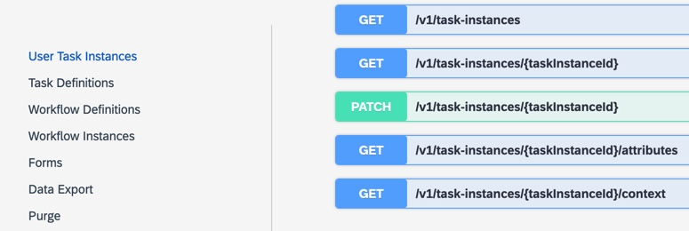

<!-- loioebbdea3409ed4bc182e0acc274ee3577 -->

# Tags

You can define tags to group related operations by logical categories rather than just by resources.

This helps the API consumer to easily identify the operations that provide a certain functionality, thus improving the usability of the API documentation. The following picture shows the API operations grouped by tags.



You define the tags under `tags` in the `OpenAPI Specification` root object. Each tag is identified by its `name`, which must be unique in the list of tags, an optional `description`, and `externalDocs`. You can then assign the defined tags to operations, referring to them by names. You can define a tag directly in an operation even if it isn’t defined on the root level.

> ### Note:  
> For detailed information about tags, see [Tag Object](Tag Objecthttps://github.com/OAI/OpenAPI-Specification/blob/master/versions/3.0.2.md#tagObject) in the OpenAPI Specification.

You describe a `tag` using the following properties:


<table>
<tr>
<th valign="top">

Property


</th>
<th valign="top">

Description


</th>
</tr>
<tr>
<td valign="top">

 `name` 


</td>
<td valign="top">

The name of a category that appears as a title above the operations. Use nouns, but in some special cases you can use a verb, and no more than one or two words, in title case, for example, *Documents* or *Order Management*. The name must be unique in the list of tags.

> ### Note:  
> The name should be plural if it’s a noun at the end.


</td>
</tr>
<tr>
<td valign="top">

 `description` 


</td>
<td valign="top">

An optional sentence that appears next to the name. Use when the tag name doesn't convey enough information.


</td>
</tr>
<tr>
<td valign="top">

 `externalDocs` 


</td>
<td valign="top">

An optional link to external documentation.


</td>
</tr>
</table>


## Example

```

tags:
- name: User Task Instances
  description: ''
- name: Workflow Definitions
  description: ''
- name: Workflow Instances
  description: ''

...
get:
      tags:
      - Task Instances
      description: Retrieves the context of a task.
   


```

**Related Information**  


[External Documentation](external-documentation-5455384.md "You can enhance your API reference documentation by providing links to external documentation.")

[General Guidelines for Descriptions](general-guidelines-for-descriptions-7e6e472.md "Provide descriptions for the various API elements supported by the OpenAPI Specification.")

