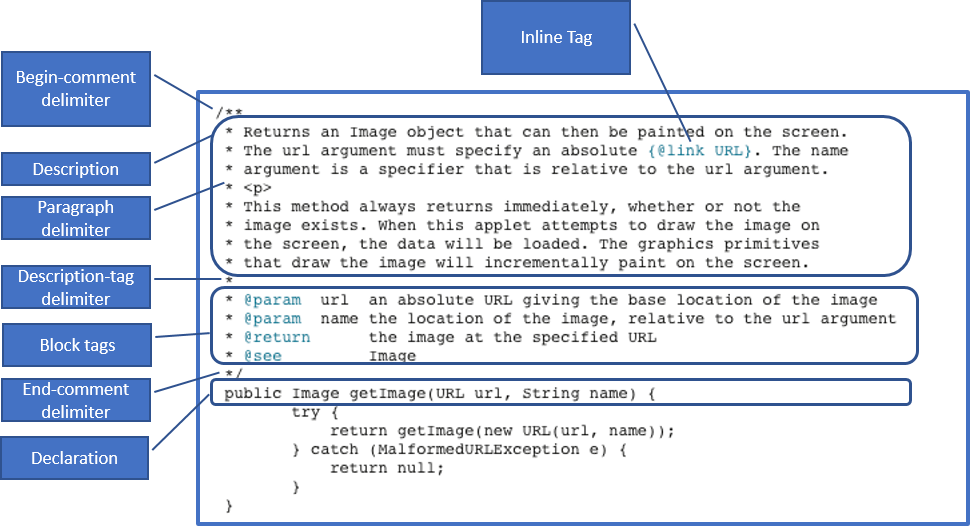
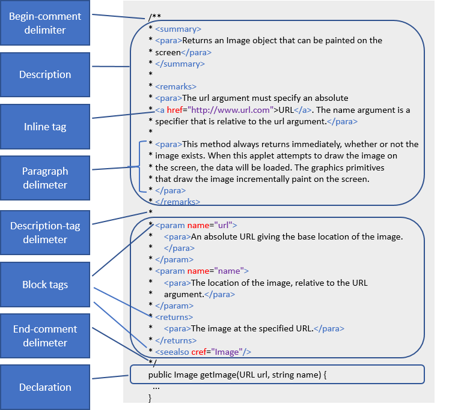

<!-- loiodaea465f1e2e4985adacc573ac5670dd -->

# Documentation Comments

To generate the API reference, write documentation comments in the API source code according to specific rules.

You write a documentation comment before the declaration of a namespace, class, interface, or class/interface member. A comment is usually made up of a description and block tags, separated by delimiters.

The following figures show the structure and syntax of a documentation comment.

## Java, JavaScript

## .NET

For .NET APIs, you can place documentation comments in an external XML file, and then use the `<include>` tag to reference that file in the source code.

-   **[Description](description-33a5538.md "The description is mandatory in a documentation comment of a class, interface, class
		member, or interface member.")**  
The description is mandatory in a documentation comment of a class, interface, class member, or interface member.
-   **[Tags](tags-680a918.md "Documentation comments include special tags that are used by generation tools for
		generating structured API reference documentation. ")**  
Documentation comments include special tags that are used by generation tools for generating structured API reference documentation.

**Related Information**  

[<include\> Tag](include-tag-9e787d7.md)

