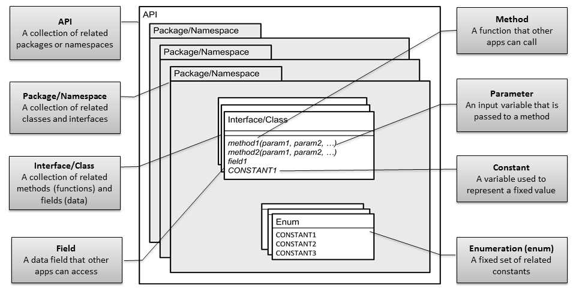
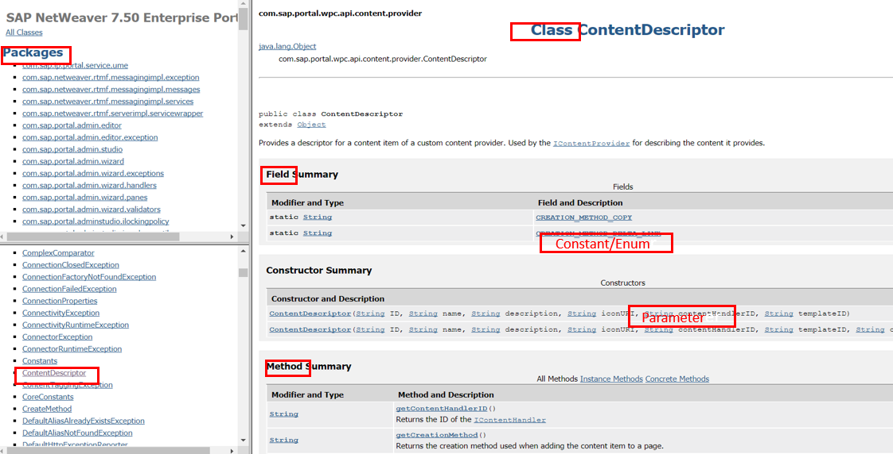

<!-- loio508e420c3c2347ba9d439e630f304d9f -->

# Java, JavaScript and MS.NET API Reference Documentation

Standards and guidelines to help you author API reference documentation that is auto-generated from Java, JavaScript and Microsoft.NET source code.

The following figure illustrates the basic structure of an API in object-oriented languages such as Java, JavaScript, .NET, or C/C++, which are discussed in this document, and introduces the main API terms.

The following figure shows a sample Java API structure \([SAP NetWeaver 7.50 Enterprise Portal](https://help.sap.com/doc/2f39047ed6b141cb83658041d2d4e029/7.5.10/en-US/EP/index.html)\):

  

-   **[Documentation Comments](documentation-comments-daea465.md "To generate the API reference, write documentation comments in the API source code
		according to specific rules.")**  
To generate the API reference, write documentation comments in the API source code according to specific rules.
-   **[Documentation Tags](documentation-tags-4deb3c0.md "The other types of  API documentation generators used at SAP support the following
		documentation tags.")**  
The other types of API documentation generators used at SAP support the following documentation tags.
-   **[Java API Documentation Templates](java-api-documentation-templates-e91b065.md "Use the collection of templates to write documentation comments for Java
		APIs.")**  
Use the collection of templates to write documentation comments for Java APIs.

