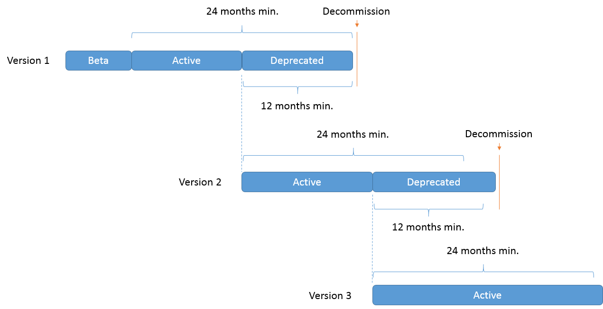

<!-- loio65a10e3d184f461a9dd57cced9ff7ea2 -->

# API Deprecation Policy

Rules that address API deprecation and decommission their deliverables.

The SAP Deprecation Policy applies only to APIs with customer adoption or use. Its goal is to set a standard for SAP to sunset APIs, providing transparency to customers for their planning.

> ### Note:  
> The following information applies to APIs published in the SAP API Business Hub, but can also be extended to all APIs across SAP organizations. This policy is considered as the minimum standard. Lines of Business \(LoB\) can establish stricter policies.


<a name="loio65a10e3d184f461a9dd57cced9ff7ea2__section_xnp_1qp_4fb"/>

## What Is Deprecation?

A deprecated API is no longer supported in future releases, and therefore not encouraged for use. Deprecated APIs can’t be removed immediately, because this can break existing client code. Deprecation is a tool for ensuring smooth transition between API releases. A deprecated API must have a successor API, available from the date of deprecation.

A decommissioned API has been retired and can’t be used in production.


<a name="loio65a10e3d184f461a9dd57cced9ff7ea2__section_gjg_wqp_4fb"/>

## The Lifecycle of an API

An API can evolve through different states, from beta version to retirement. SAP added the `x-sap-stateInfo` attribute to the OpenAPI specification to display the current status of an API in the SAP API Business Hub:

```
{
   "swagger": "2.0",
   "info": {
      "title": "Business API",
      "version": "1.1.2",
      "description": "API for Reading Business Partner, Supplier, Customer  and Contact Persons"
   },
   "x-sap-stateInfo": {
      "state": "Deprecated",
      "deprecationDate": "14 Aug 2018",
      "successorApi": "http://api.sap.com/api/product_text_classification_api"
   }
}
```


<table>
<tr>
<th valign="top">

Property


</th>
<th valign="top">

Description


</th>
</tr>
<tr>
<td valign="top">

`state`


</td>
<td valign="top">

The API status:

-   `Beta` – The API isn’t used in production, but is intended to be in the future. The API might have incompatible changes before it is active.
-   `Active` – The API is live and meant for production use.
-   `Deprecated` – The API is live in production, but replaced with its active version.
-   `Decommissioned` – The API is retired from production.

The default status of a published API is `Active`.


</td>
</tr>
<tr>
<td valign="top">

`deprecationDate`


</td>
<td valign="top">

The starting date of the actual deprecation in production.


</td>
</tr>
<tr>
<td valign="top">

`successorApi`


</td>
<td valign="top">

The active API that replaces the deprecated API.


</td>
</tr>
</table>

The API change information must also be added to the `Artifact.json` file of the API package.

```
{
  "type": "API",
  "changelog": [
    {
      "state": "Deprecated",
      "date": "19 Jan 2019",
      "version": "1.0",
      "notes": "New API with enhanced functionality is available here"
    },
    {
      "state": "Active",
      "date": "18 Jan 2018",
      "version": "1.0.0",
      "notes": "Some bug fixes and performance enhancement"
    }
  ]
}
```


<table>
<tr>
<th valign="top">

Property


</th>
<th valign="top">

Description


</th>
</tr>
<tr>
<td valign="top">

`state`


</td>
<td valign="top">

The API status \(`Beta`, `Active`, `Deprecated`, or `Decommissioned`\).


</td>
</tr>
<tr>
<td valign="top">

`date`


</td>
<td valign="top">

The starting date of the actual change in production.


</td>
</tr>
<tr>
<td valign="top">

`version`


</td>
<td valign="top">

The version of the API.


</td>
</tr>
<tr>
<td valign="top">

`notes`


</td>
<td valign="top">

Information about the change.


</td>
</tr>
</table>

To see an example of how a status change appears on the SAP API Business Hub, see [API Life Cycle](https://help.sap.com/viewer/84b35b9c39b247e3ba2a31f02beee46d/Cloud/en-US/788a308b80c4436bb27088a221df4077.html).


<a name="loio65a10e3d184f461a9dd57cced9ff7ea2__section_urj_yqp_4fb"/>

## Recommendations

The industry commonly designs their deprecation policies according to the following three parameters:

-   **The minimum lifespan of an API after publication** provides easier planning and ease-of-mind for the consumption of recently published APIs. This enables faster consumption of new API versions.
-   **The minimum notification period before deprecation** provides early communication to allow development teams to plan for necessary API upgrade efforts.
-   **The minimum support period after deprecation announcement** communicates that deprecation doesn’t automatically lead to an API being unsupported, but allows for a period where support and fixes are still provided.

We recommend the following periods:

-   **A minimum period of 12 months after entering deprecation**.
-   **A period of 24 months as the minimum lifespan of an API** in active or deprecated stage before announcing the decommission.




<a name="loio65a10e3d184f461a9dd57cced9ff7ea2__section_ulf_zqp_4fb"/>

## What Is the Role of the Product Owner?

The product owner is responsible for the lifecycle of the API. Therefore, as a UA developer, your main point of contact regarding the API lifecycle is the product owner. They decide when and whether an API changes status, for example when an API is published to the SAP API Business Hub or when it’s deprecated. They make sure the API deprecation and decommission are announced well in advance through the available channels, such as release notes and blogs. They ensure that the deprecated version is supported for at least 12 months. The product owner also informs product support of the API change.

In the SAP API Business Hub, the product owner:

-   Makes sure that the `x-sap-stateInfo` attribute is defined correctly. If not defined or left empty, then the default status of the API is set to `Active`.
-   Enters the change log information in the `Artifact.json` file of the API package.

The `x-sap-stateInfo` attribute and change log are used to clearly state the reasons behind the change and to provide developers with a clear transition path for the deprecated functionality.


<a name="loio65a10e3d184f461a9dd57cced9ff7ea2__section_gyt_rrp_4fb"/>

## What Is the Role of the UA Developer?

The UA developer reflects the product owner's decision in the UA deliverables.

**In the SAP API Business Hub \(REST APIs\)**

-   Review the language in the `notes` property of the change log.
-   Remove the link to the Help Portal documentation of the decommissioned version from the SAP API Business Hub, add *Decommissioned* to the title of your topic, and archive the topic somewhere in your documentation set.

**In an API Reference \(other APIs\)**

Add the appropriate tag to the source code's comment, if not done by the developer. A good practice is to indicate the successor of the deprecated API.

For example, in a Java source file:

```
/**
 * Use {@link RelationalBinding#getSelect()} instead.
 *
 */
@Deprecated
String getSelect();
```

**In the Developer Guide**

You must announce the deprecation followed by information about the successor API in release notes. You can also update existing code snippets or add new code snippets to reflect the changes.


<a name="loio65a10e3d184f461a9dd57cced9ff7ea2__section_a1s_znw_qsb"/>

## Removing Decommissioned APIs

In order to remove the decommissioned APIs do the following:

1.  In the package structure, navigate to the Artifacts folder.
2.  Delete the folder corresponding to the decommissioned API.

    To decommission a particular API endpoint, edit the artifact.json file and remove the end point.

3.  Push your changes to GIT, and re-submit the package for publishing.

