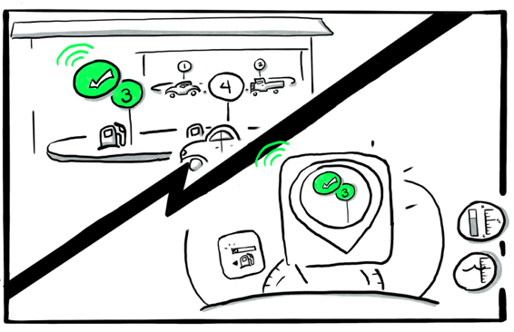

<!-- loioab2672cc1a6d45168f054889e1905166 -->

# What Is an API?

Application Programming Interface or API is an interface provided by an application for interacting with other applications.

APIs specify how software programs are able to exchange information with each other, even if designed and run by different organizations. They facilitate interaction by selectively exposing certain functionality, allowing different apps, websites, and devices to communicate effectively with each other. More importantly, APIs allow businesses to reach beyond regular business channels and share data, content, and services directly to both B2B \(business to business\) and B2C \(business to consumer\) clients, making UI development easy.

Now, let's see how APIs work:

1.  Our company creates an application for customers to do something, such as create and display maps.

2.  So that anyone can display our maps in their application, we create an API to enable customers to call our application.

3.  The customer creates an application, such as a customer relationship application \(CRM\).

4.  From the CRM application, the customer calls our API to add a map next to their customer’s profile.

5.  Our application receives the call and does something, such as access our proprietary map database. What our application does can be as complicated as it needs to be, but the customer doesn't need to know exactly what we are doing behind the scenes.

6.  When our application is ready, it sends a response, for example, that a map for a given address was requested by the customer.

To summarize:

1.  We create an API and customers call our API. Sometimes, it's also vice versa. Our customers consume an API that allows SAP business systems to request information from them.

2.  When our application is ready, it sends a response – either:

    1.  A confirmation that we did something, or

    2.  Some information requested by the customer.

3.  We do some stuff and we send back a response that gives our customers the information they need for their own application.

Let's use an example to explain how APIs work in our daily lives:

  

Jenny received an mBot robot kit for her birthday. She built the robot and wanted to program it to do more than what is available off the shelf.

In order to program the robot to perform certain tasks, she needed to call an API that was created by mBot to provide humidity and temperature readings.

First, Jenny added a display and sensors to the robot and then she used the mBlock coding platform to create a program to control the robot.

And in that program, the mBot calls an API to:

-   Get the humidity reading when the robot starts operating, which:

    -   Turns on a blue light

    -   Checks the humidity

    -   Returns the percentage of humidity on the display panel

-   Get the temperature if the **My Temperature** and **Humidity** buttons are pressed, which

    -   Turns on a red light

    -   Checks the temperature

    -   Returns the temperature in Celsius or Fahrenheit on the display panel

You can see in this example that an API can perform a simple task, such as checking humidity and temperature readings wherever the mBot happens to be.

APIs can perform complex tasks too, such as this everyday example:

1.  Find the nearest petrol station and display the directions on the car console.

      

2.  Find the first available pump and send the pump's location or number to the car console as a popup message.

      

3.  Send a message to the pump that identifies the customer, and tells the customer that they can start filling their tank.

      

4.  Send advertisements to the pump's screen and to the car console enticing the customer to buy something in the store. Send a coupon for a free coffee and pastry to the customer's mobile phone app.

      

5.  Pull credit card information when the petrol tank is full, and pay for the petrol. Send payment confirmation to the customer's mobile phone app.

      

